# Java Lab Programs

This repository contains **Java Lab Experiments** with **Aim, Code, and Output**.

---

# Experiment 1

## 1A – Default Values of Primitive Data Types

**Aim:**
Write a JAVA program to display default value of all primitive data types.

**Code:**

```java
class primitive
{
  byte byte_datatype;
   short short_datatype;
  int integer;
 long long_datatype;
 float floating;
  double double_datatype;
  char character;
  boolean boolean_datatype;
}
class task1a {
  public static void main(String[] args)
{
   primitive obj=new primitive();
  
        System.out.println("defalut byte value : " + obj.byte_datatype);
        System.out.println("default short value: " + obj.short_datatype);
        System.out.println("defalut int value  : " + obj.integer);
        System.out.println("defalut long value : " + obj.long_datatype);
        System.out.println("defalut float value: " + obj.floating);
        System.out.println("defalut double value: " + obj.double_datatype);
        System.out.println("defalut char value : " + obj.character);
        System.out.println("defalut boolean valuue: " + obj.boolean_datatype);
    }
}
```

**Output:**

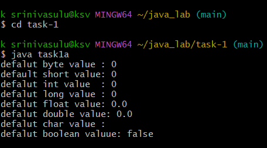

---

## 1B – Roots of Quadratic Equation

**Aim:**
Write a JAVA program that displays the roots of a quadratic equation ax²+bx+c=0.

**Code:**

```java
// Paste your code from task-1/task1b.java here
```

**Output:**

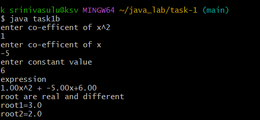

---

# Experiment 2

## 2A – Class Mechanism

**Aim:**
Implement class mechanism in JAVA.

**Code:**

```java
// Paste your code from task-2/task2a.java here
```

**Output:**

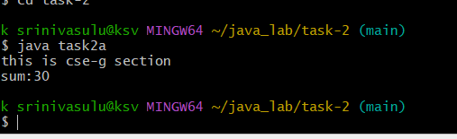

---

## 2B – Method Overloading

**Aim:**
Write a JAVA program to implement method overloading.

**Code:**

```java
// Paste your code from task-2/task2b.java here
```

**Output:**

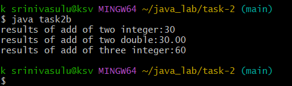

---

## 2C – Constructor Implementation

**Aim:**
Write a JAVA program to implement constructor.

**Code:**

```java
// Paste your code from task-2/task2c.java here
```

**Output:**

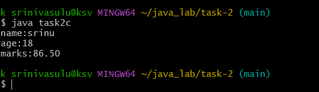

---

# Experiment 3

## 3A – Constructor Overloading

**Aim:**
Implement constructor overloading in JAVA.

**Code:**

```java
// Paste your code from task-3/task3a.java here
```

**Output:**

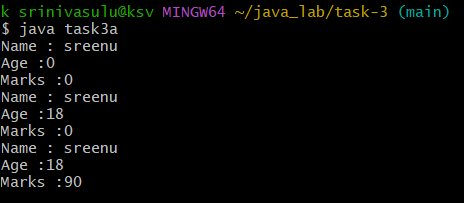

---

## 3B – Binary Search

**Aim:**
Write a JAVA program to search an element using binary search.

**Code:**

```java
// Paste your code from task-3/task3b.java here
```

**Output:**

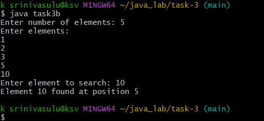

---

## 3C – Bubble Sort

**Aim:**
Develop a JAVA program to sort elements using bubble sort.

**Code:**

```java
// Paste your code from task-3/task3c.java here
```

**Output:**

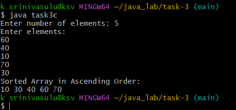

---

# Experiment 4

## 4A – Single Inheritance

**Aim:**
Write a JAVA program to implement single inheritance.

**Code:**

```java
// Paste your code from task-4/task4a.java here
```

**Output:**

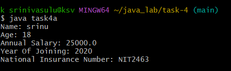

---

## 4B – Multilevel Inheritance

**Aim:**
Write a JAVA program to implement multilevel inheritance.

**Code:**

```java
// Paste your code from task-4/task4b.java here
```

**Output:**

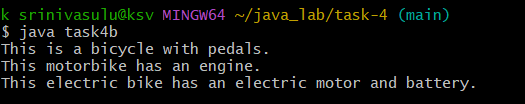

---

## 4C – Abstract Class

**Aim:**
Construct an abstract class to find areas of different shapes.

**Code:**

```java
// Paste your code from task-4/task4c.java here
```

**Output:**

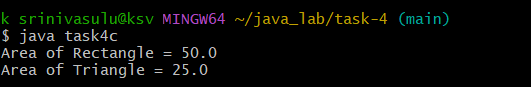

---

# Experiment 5

## 5A – Interface Implementation

**Aim:**
Write a JAVA program to implement interface.

**Code:**

```java
// Paste your code from task-5/task5a.java here
```

**Output:**

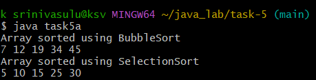

---

## 5B – Runtime Polymorphism

**Aim:**
Write a JAVA program that implements runtime polymorphism.

**Code:**

```java
// Paste your code from task-5/task5b.java here
```

**Output:**

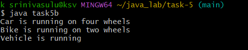

---

## 5C – StringBuffer Operations

**Aim:**
Write a JAVA program using StringBuffer to delete and remove characters.

**Code:**

```java
// Paste your code from task-5/task5c.java here
```

**Output:**

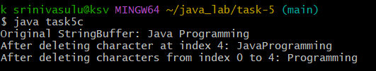

---

# Experiment 6

## 6A – Exception Handling

**Aim:**
Write a JAVA program that describes exception handling mechanism.

**Code:**

```java
// Paste your code from task-6/task6a.java here
```

**Output:**

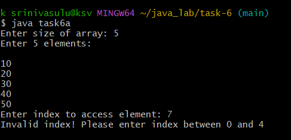

---

## 6B – Multiple Catch Clauses

**Aim:**
Write a JAVA program illustrating multiple catch clauses.

**Code:**

```java
// Paste your code from task-6/task6b.java here
```

**Output:**

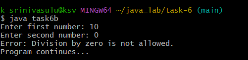

---

## 6C – Built-in Exceptions

**Aim:**
Write a JAVA program for built-in exceptions.

**Code:**

```java
// Paste your code from task-6/task6c.java here
```

**Output:**

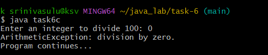

---

# Experiment 7

## 7A – User Defined Exception

**Aim:**
Write a JAVA program for user defined exception.

**Code:**

```java
// Paste your code from task-7/task7a.java here
```

**Output:**

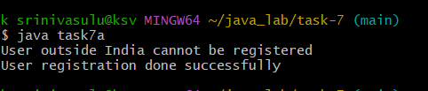

---

## 7B – Thread Creation using Thread Class

**Aim:**
Write a JAVA program that creates threads by extending Thread class.

**Code:**

```java
// Paste your code from task-7/task7b.java here
```

**Output:**

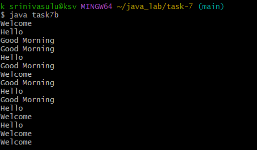

---

## 7C – Runnable Interface Threads

**Aim:**
Repeat the thread program using Runnable interface.

**Code:**

```java
// Paste your code from task-7/task7c.java here
```

**Output:**

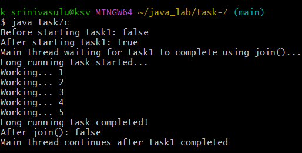

---

# Experiment 8

## 8A – Daemon Threads

**Aim:**
Write a JAVA program illustrating daemon threads.

**Code:**

```java
// Paste your code from task-8/task8a.java here
```

**Output:**

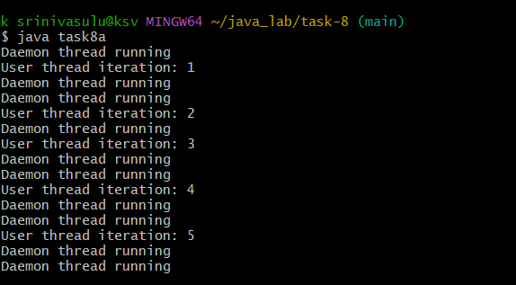

---

## 8B – Producer Consumer Problem

**Aim:**
Write a JAVA program implementing Producer Consumer problem using inter-thread communication.

**Code:**

```java
// Paste your code from task-8/task8b.java here
```

**Output:**

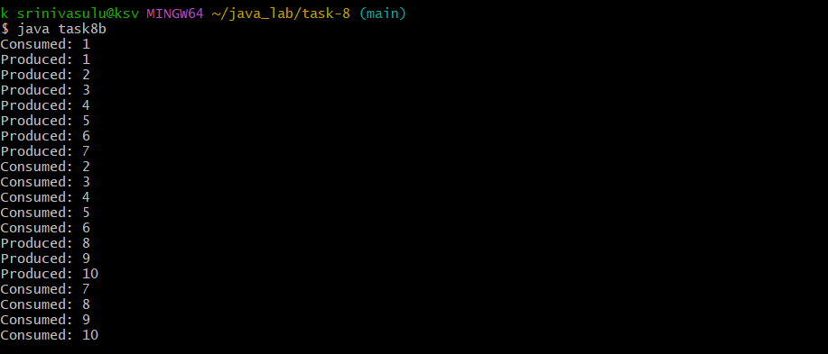

---

## 8C – User Defined Packages

**Aim:**
Write a JAVA program that imports and uses user defined packages.

**Code:**

```java
// Paste your code from task-8/task8c.java here
```

**Output:**

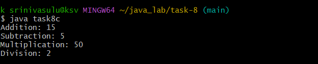

---
